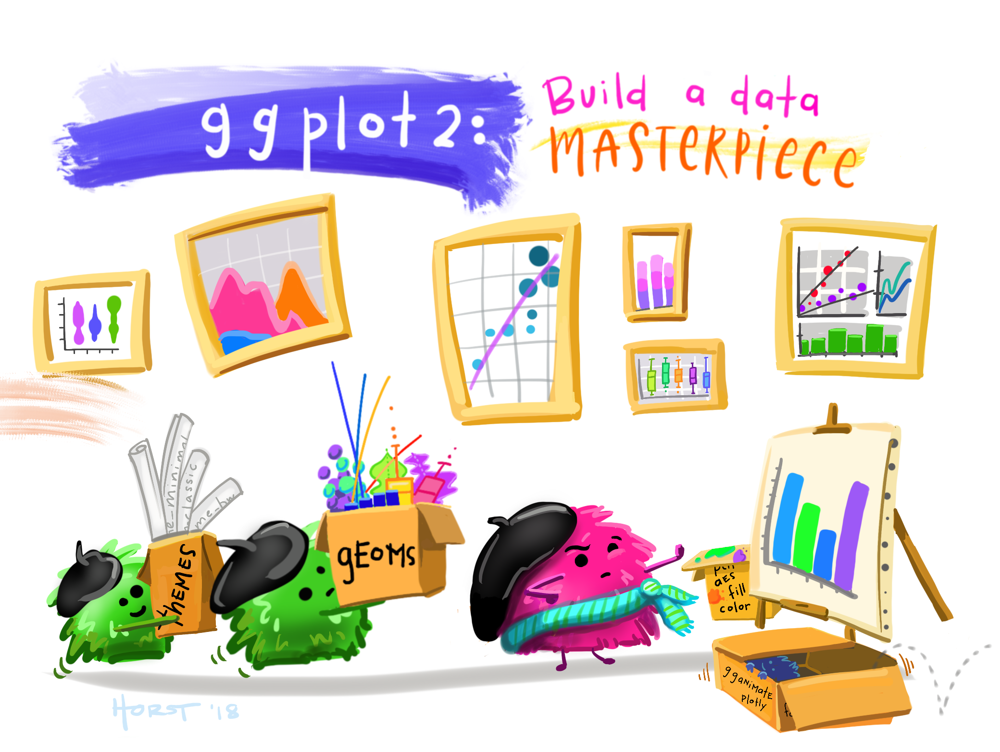

## [Basic Principles and Essential Components of ggplot2]{style="color:  #4682B4; font-size: 38px;"}

This page introduces the **Layered Grammar of Graphics** and demonstrates how ggplot2 implements it through its essential components.

{width="518"}

## [1. Installing and loading the required libraries]{style="color:  #2C5282; font-size: 28px;"}

Load the required packages:

```{r}
pacman::p_load(tidyverse)
```

## [2. Importing Data]{style="color:  #2C5282; font-size: 28px;"}

-   The code chunk below imports exam_data.csv into R environment by using read_csv() function of readr package.

-   readr is one of the tidyverse package.

```{r}
exam_data <- read_csv("data/Exam_data.csv")
```

## [3. R Graphics VS ggplot]{style="color:  #2C5282; font-size: 28px;"}

Let us compare how R Graphics, the core graphical functions of Base R and ggplot plot a simple histogram.

```{r}
hist(exam_data$MATHS)
```

```{r}
ggplot(data=exam_data, aes(x = MATHS)) +
  geom_histogram(bins=10, 
                 boundary = 100,
                 color="black", 
                 fill="grey") +
  ggtitle("Distribution of Maths scores")
```

The code chunk is relatively simple if R Graphics is used. Then, the question is why ggplot2 is recommended?

## [4. Essential Grammatical Elements in ggplot2: data]{style="color:  #2C5282; font-size: 28px;"}

```{r}
ggplot(data=exam_data)
```

-   A blank canvas appears.

-   `ggplot()` initializes a ggplot object.

-   The *data* argument defines the dataset to be used for plotting.

-   If the dataset is not already a data.frame, it will be converted to one by `fortify()`.

## [5. Essential Grammatical Elements in ggplot2: Aesthetic mappings]{style="color:  #2C5282; font-size: 28px;"}

The aesthetic mappings take attributes of the data and and use them to influence visual characteristics, such as position, colour, size, shape, or transparency. Each visual characteristic can thus encode an aspect of the data and be used to convey information.

All aesthetics of a plot are specified in the [`aes()`](https://ggplot2.tidyverse.org/reference/aes.html) function call (in later part of this lesson, you will see that each *geom* layer can have its own aes specification)

Code chunk below adds the aesthetic element into the plot.

```{r}
ggplot(data=exam_data, 
       aes(x= MATHS))
```

## [6. Essential Grammatical Elements in ggplot2: geom]{style="color:  #2C5282; font-size: 28px;"}

Geometric objects are the actual marks we put on a plot. Examples include:

-   *geom_point* for drawing individual points (e.g., a scatter plot)

-   *geom_line* for drawing lines (e.g., for a line charts)

-   *geom_smooth* for drawing smoothed lines (e.g., for simple trends or approximations)

-   *geom_bar* for drawing bars (e.g., for bar charts)

-   *geom_histogram* for drawing binned values (e.g. a histogram)

-   *geom_polygon* for drawing arbitrary shapes

-   *geom_map* for drawing polygons in the shape of a map! (You can access the data to use for these maps by using the map_data() function).

{width="601"}

-   A plot must have at least one geom; there is no upper limit. You can add a geom to a plot using the **+** operator.

-   For complete list, please refer to [here](https://ggplot2.tidyverse.org/reference/#section-layer-geoms).

## [6.1 Geometric Objects: geom_bar()]{style="color:  #366092; font-size: 24px;"}

```{r}
ggplot(data=exam_data, 
       aes(x=RACE)) +
  geom_bar()
```

## [6.2 Geometric Objects: geom_dotplot()]{style="color:  #366092; font-size: 24px;"}

In a dot plot, the width of a dot corresponds to the bin width (or maximum width, depending on the binning algorithm), and dots are stacked, with each dot representing one observation.

```{r}
ggplot(data=exam_data, 
       aes(x = MATHS)) +
  geom_dotplot(dotsize = 0.5)
```

```{r}
ggplot(data=exam_data, 
       aes(x = MATHS)) +
  geom_dotplot(binwidth=2.5,         
               dotsize = 0.5) +      
  scale_y_continuous(NULL,           
                     breaks = NULL)  
```

## [6.3 Geometric Objects: geom_histogram()]{style="color:  #366092; font-size: 24px;"}

```{r}
ggplot(data=exam_data, 
       aes(x = MATHS)) +
  geom_histogram()       
```

## [6.4 Modifying a Geometric Object by Changing geom()]{style="color:  #366092; font-size: 24px;"}

In the code chunk below,

-   *bins* argument is used to change the number of bins to 20,

-   *fill* argument is used to shade the histogram with light blue color, and

-   *color* argument is used to change the outline colour of the bars in black

```{r}
ggplot(data=exam_data, 
       aes(x= MATHS)) +
  geom_histogram(bins=20,            
                 color="black",      
                 fill="light blue")  
```

## [6.5 Modifying a Geometric Object by Changing aes()]{style="color:  #366092; font-size: 24px;"}

The code chunk below changes the interior colour of the histogram (i.e. *fill*) by using sub-group of *aesthetic()*.

```{r}
ggplot(data=exam_data, 
       aes(x= MATHS, 
           fill = GENDER)) +
  geom_histogram(bins=20, 
                 color="grey30")
```

## [6.6 Geometric Objects: geom_density()]{style="color:  #366092; font-size: 24px;"}

[`geom-density()`](https://ggplot2.tidyverse.org/reference/geom_density.html) computes and plots [kernel density estimate](https://en.wikipedia.org/wiki/Kernel_density_estimation), which is a smoothed version of the histogram.

It is a useful alternative to the histogram for continuous data that comes from an underlying smooth distribution.

The code below plots the distribution of Maths scores in a kernel density estimate plot.

```{r}
ggplot(data=exam_data, 
       aes(x = MATHS)) +
  geom_density()           
```

The code chunk below plots two kernel density lines by using *colour* or *fill* arguments of *aes()*

```{r}
ggplot(data=exam_data, 
       aes(x = MATHS, 
           colour = GENDER)) +
  geom_density()
```

## [6.7 Geometric Objects: geom_boxplot()]{style="color:  #366092; font-size: 24px;"}

[`geom_boxplot()`](https://ggplot2.tidyverse.org/reference/geom_boxplot.html) displays continuous value list. It visualises five summary statistics (the median, two hinges and two whiskers), and all “outlying” points individually.

The code chunk below plots boxplots by using [`geom_boxplot()`](https://ggplot2.tidyverse.org/reference/geom_boxplot.html).

```{r}
ggplot(data=exam_data, 
       aes(y = MATHS,       
           x= GENDER)) +    
  geom_boxplot()            
```

[**Notches**](https://sites.google.com/site/davidsstatistics/home/notched-box-plots) are used in box plots to help visually assess whether the medians of distributions differ. If the notches do not overlap, this is evidence that the medians are different.

The code chunk below plots the distribution of Maths scores by gender in notched plot instead of boxplot.

```{r}
ggplot(data=exam_data, 
       aes(y = MATHS, 
           x= GENDER)) +
  geom_boxplot(notch=TRUE)
```

## [6.8 Geometric Objects: geom_violin()]{style="color:  #366092; font-size: 24px;"}

[`geom_violin`](https://ggplot2.tidyverse.org/reference/geom_violin.html) is designed for creating violin plot. Violin plots are a way of comparing multiple data distributions. With ordinary density curves, it is difficult to compare more than just a few distributions because the lines visually interfere with each other. With a violin plot, it’s easier to compare several distributions since they’re placed side by side.

The code below plot the distribution of Maths score by gender in violin plot.

```{r}
ggplot(data=exam_data, 
       aes(y = MATHS, 
           x= GENDER)) +
  geom_violin()
```

## [6.9 Geometric Objects: geom_point()]{style="color:  #366092; font-size: 24px;"}

[`geom_point()`](https://ggplot2.tidyverse.org/reference/geom_point.html) is especially useful for creating scatterplot.

The code chunk below plots a scatterplot showing the Maths and English grades of pupils by using `geom_point()`.

```{r}
ggplot(data=exam_data, 
       aes(x= MATHS, 
           y=ENGLISH)) +
  geom_point()            
```

## [6.10 geom Objects can be Combined]{style="color:  #366092; font-size: 24px;"}

[`geom_point()`](https://ggplot2.tidyverse.org/reference/geom_point.html) is especially useful for creating scatterplot.

The code chunk below plots the data points on the boxplots by using both `geom_boxplot()` and `geom_point()`.

```{r}
ggplot(data=exam_data, 
       aes(y = MATHS, 
           x= GENDER)) +
  geom_boxplot() +                    
  geom_point(position="jitter", 
             size = 0.5)        
```

## [7. Essential Grammatical Elements in ggplot2: stat]{style="color:  #2C5282; font-size: 28px;"}

The [Statistics functions](https://ggplot2.tidyverse.org/reference/index.html#stats) statistically transform data, usually as some form of summary. For example:

-   frequency of values of a variable (bar graph)

    -   a mean

    -   a confidence limit

-   There are two ways to use these functions:

    -   add a `stat_()` function and override the default geom, or

    -   add a `geom_()` function and override the default stat.

## [7.1 Working with stat()]{style="color:  #366092; font-size: 24px;"}

The boxplots below are incomplete because the positions of the means were not shown.

```{r}
ggplot(data=exam_data, 
       aes(y = MATHS, x= GENDER)) +
  geom_boxplot()
```

## [7.2 Working with stat - the stat_summary() method]{style="color:  #366092; font-size: 24px;"}

The code chunk below adds mean values by using [`stat_summary()`](https://ggplot2.tidyverse.org/reference/stat_summary.html) function and overriding the default geom.

```{r}
ggplot(data=exam_data, 
       aes(y = MATHS, x= GENDER)) +
  geom_boxplot() +
  stat_summary(geom = "point",       
               fun = "mean",         
               colour ="red",        
               size=4)               
```

## [7.3 Working with stat - the geom() method]{style="color:  #366092; font-size: 24px;"}

The code chunk below adding mean values by using `geom_()` function and overriding the default stat.

```{r}
ggplot(data=exam_data, 
       aes(y = MATHS, x= GENDER)) +
  geom_boxplot() +
  geom_point(stat="summary",        
             fun="mean",           
             colour="red",          
             size=4)          
```

## [7.4 Adding a Best Fit Curve on a Scatterplot]{style="color:  #366092; font-size: 24px;"}

The scatterplot below shows the relationship of Maths and English grades of pupils. The interpretability of this graph can be improved by adding a best fit curve.

In the code chunk below, [`geom_smooth()`](https://ggplot2.tidyverse.org/reference/geom_smooth.html) is used to plot a best fit curve on the scatterplot.

```{r}
ggplot(data=exam_data, 
       aes(x= MATHS, y=ENGLISH)) +
  geom_point() +
  geom_smooth(size=0.5)
```

The default smoothing method can be overridden as shown below.

```{r}
ggplot(data=exam_data, 
       aes(x= MATHS, 
           y=ENGLISH)) +
  geom_point() +
  geom_smooth(method=lm, 
              linewidth=0.5)
```

## [8. Essential Grammatical Elements in ggplot2: Facets]{style="color:  #2C5282; font-size: 28px;"}

Facetting generates small multiples (sometimes also called trellis plot), each displaying a different subset of the data. They are an alternative to aesthetics for displaying additional discrete variables. ggplot2 supports two types of factes, namely: [`facet_grid()`](https://ggplot2.tidyverse.org/reference/facet_grid.html) and [`facet_wrap`](https://ggplot2.tidyverse.org/reference/facet_wrap.html).

## [8.1 Working with facet_wrap()]{style="color:  #366092; font-size: 24px;"}

[`facet_wrap`](https://ggplot2.tidyverse.org/reference/facet_wrap.html) wraps a 1d sequence of panels into 2d. This is generally a better use of screen space than facet_grid because most displays are roughly rectangular.

The code chunk below plots a trellis plot using `facet-wrap()`.

```{r}
ggplot(data=exam_data, 
       aes(x= MATHS)) +
  geom_histogram(bins=20) +
    facet_wrap(~ CLASS)
```

## [8.2 facet_grid() Function]{style="color:  #366092; font-size: 24px;"}

[`facet_grid()`](https://ggplot2.tidyverse.org/reference/facet_grid.html) forms a matrix of panels defined by row and column facetting variables. It is most useful when you have two discrete variables, and all combinations of the variables exist in the data.

The code chunk below plots a trellis plot using `facet_grid()`.

```{r}
ggplot(data=exam_data, 
       aes(x= MATHS)) +
  geom_histogram(bins=20) +
    facet_grid(~ CLASS)
```

## [9. Essential Grammatical Elements in ggplot2: Coordinates]{style="color:  #2C5282; font-size: 28px;"}

The *Coordinates* functions map the position of objects onto the plane of the plot. There are a number of different possible coordinate systems to use, they are:

::: {style="overflow-x: auto; white-space: nowrap; border: 1px solid #2C5282; border-radius: 5px; padding: 12px; background-color: #f8f9fa;"}
-   [`coord_cartesian()`](https://ggplot2.tidyverse.org/reference/coord_cartesian.html): the default cartesian coordinate systems, where you specify x and y values (e.g. allows you to zoom in or out).
-   [`coord_flip()`](https://ggplot2.tidyverse.org/reference/coord_flip.html): a cartesian system with the x and y flipped.
-   [`coord_fixed()`](https://ggplot2.tidyverse.org/reference/coord_fixed.html): a cartesian system with a "fixed" aspect ratio (e.g. 1.78 for a "widescreen" plot).
-   [`coord_quickmap()`](https://ggplot2.tidyverse.org/reference/coord_map.html): a coordinate system that approximates a good aspect ratio for maps.
:::

## [9.1 Working with Coordinate]{style="color:  #366092; font-size: 24px;"}

By the default, the bar chart of ggplot2 is in vertical form.

```{r}
ggplot(data=exam_data, 
       aes(x=RACE)) +
  geom_bar()
```

The code chunk below flips the horizontal bar chart into vertical bar chart by using `coord_flip()`.

```{r}
ggplot(data=exam_data, 
       aes(x=RACE)) +
  geom_bar() +
  coord_flip()
```

## [9.2 Changing the y- and x-axis Range]{style="color:  #366092; font-size: 24px;"}

The scatterplot on the right is slightly misleading because the y-aixs and x-axis range are not equal.

```{r}
ggplot(data=exam_data, 
       aes(x= MATHS, y=ENGLISH)) +
  geom_point() +
  geom_smooth(method=lm, size=0.5)
```

The code chunk below fixed both the y-axis and x-axis range from 0-100.

```{r}
ggplot(data=exam_data, 
       aes(x= MATHS, y=ENGLISH)) +
  geom_point() +
  geom_smooth(method=lm, 
              size=0.5) +  
  coord_cartesian(xlim=c(0,100),
                  ylim=c(0,100))
```

## [10. Essential Grammatical Elements in ggplot2: themes]{style="color:  #2C5282; font-size: 28px;"}

Themes control elements of the graph not related to the data. For example:

-   background colour

-   size of fonts

-   gridlines

-   colour of labels

Built-in themes include: - `theme_gray()` (default) - `theme_bw()` - `theme_classic()`

A list of theme can be found at this [link](https://ggplot2.tidyverse.org/reference/ggtheme.html). Each theme element can be conceived of as either a line (e.g. x-axis), a rectangle (e.g. graph background), or text (e.g. axis title).

## [10.1 Working with theme]{style="color:  #366092; font-size: 24px;"}

The code chunk below plot a horizontal bar chart using `theme_gray()`.

```{r}
ggplot(data=exam_data, 
       aes(x=RACE)) +
  geom_bar() +
  coord_flip() +
  theme_gray()
```

A horizontal bar chart plotted using `theme_classic()`.

```{r}
ggplot(data=exam_data, 
       aes(x=RACE)) +
  geom_bar() +
  coord_flip() +
  theme_classic()
```

A horizontal bar chart plotted using `theme_minimal()`.

```{r}
ggplot(data=exam_data, 
       aes(x=RACE)) +
  geom_bar() +
  coord_flip() +
  theme_minimal()
```

:::
