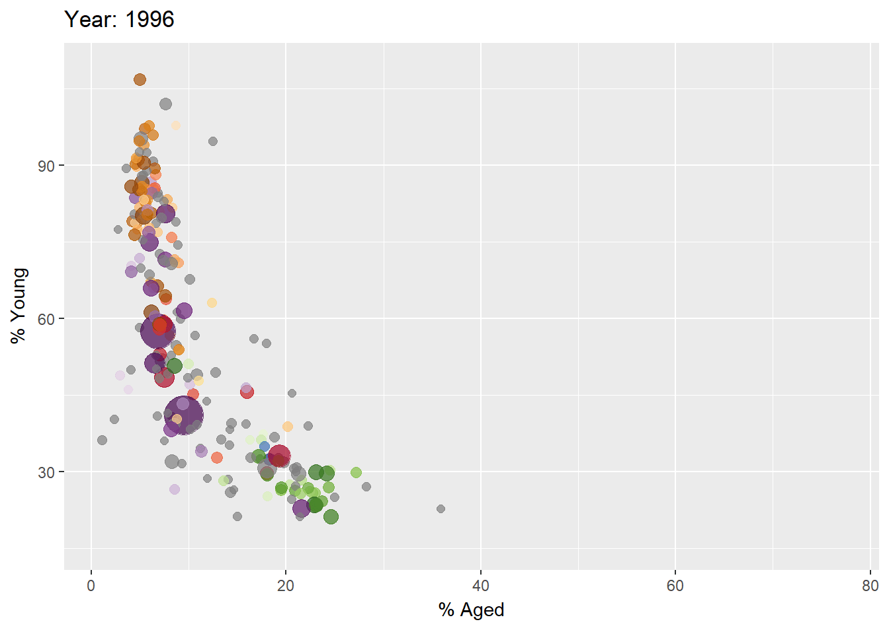
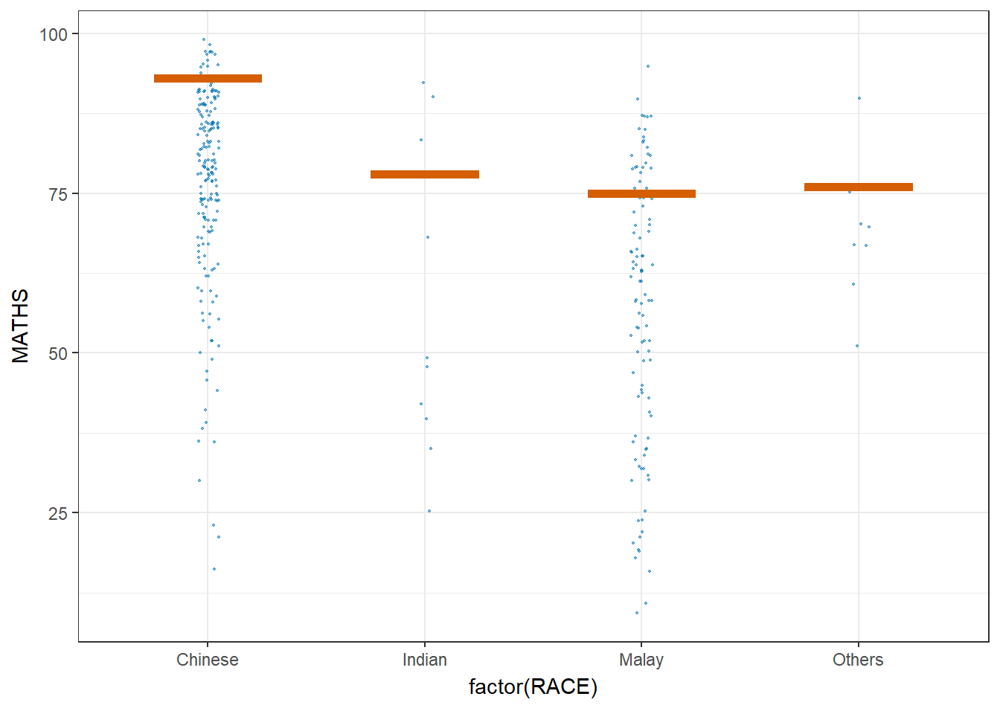

## [Hands-On Exercises Index]{style="color:  #4682B4; font-size: 38px;"}

:::: {style="display: flex; align-items: center; gap: 10px; border-left: 4px solid #2C5282; padding: 10px; background-color: #f8f9fa; border-radius: 10px;"}
{width="230"}

::: {style="flex: 1;"}
**Hands-on Exercise 1 — Basic Principles and Essential Components of ggplot2**

Explore the Layered Grammar of Graphics and learn how ggplot2 implements it through its essential components.

[Read more →](HO_EX01.html)
:::
::::

:::: {style="display: flex; align-items: center; gap: 10px; border-left: 4px solid #2C5282; padding: 10px; background-color: #f8f9fa; border-radius: 10px;"}
{width="230"}

::: {style="flex: 1;"}
**Hands-on Exercise 2 — Beyond ggplot Fundamentals**

Explored several ggplot2 extensions for creating more elegant and effective statistical graphics — covering label placement, themes, and combining plots into one figure.

[Read more →](HO_EX02.html)
:::
::::

:::: {style="display: flex; align-items: center; gap: 10px; border-left: 4px solid #2C5282; padding: 10px; background-color: #f8f9fa; border-radius: 10px;"}
{width="230"}

::: {style="flex: 1;"}
**Hands-on Exercise 3 — Programming Interactive Data Visualisation and Animated Statistical Graphics with R**

Explored several R packages for adding interactivity to static ggplots covering hover tooltips, linked highlighting, click-throughs, and coordinated multiple views.

Explored several R packages for adding motion to static ggplots covering frame transitions, easing functions, object constancy, and animated bubble charts.

[Read more →](HO_EX03.html)
:::
::::

:::: {style="display: flex; align-items: center; gap: 10px; border-left: 4px solid #2C5282; padding: 10px; background-color: #f8f9fa; border-radius: 10px;"}
{width="232"}

::: {style="flex: 1;"}
**Hands-on Exercise 4 — Funnel Plots, Distribution Charts, Visual Statistical Analysis, and Visualising Uncertainty**

Explored (1) fair comparisons across units of different sizes covering funnel plots, control limits, and overdispersion adjustments, (2) visualising distributions covering ridgeline plots, raincloud plots, quantile colouring, and gradient fills along the x-axis, (3) visual statistical analysis covering one-sample tests, ANOVA, correlation tests, and chi-square tests with statistical details embedded in the chart, and (4) visualising uncertainty covering standard error bars, confidence intervals, gradient intervals, and Hypothetical Outcome Plots (HOPs).

[Read more →](HO_EX04.html)
:::
::::
