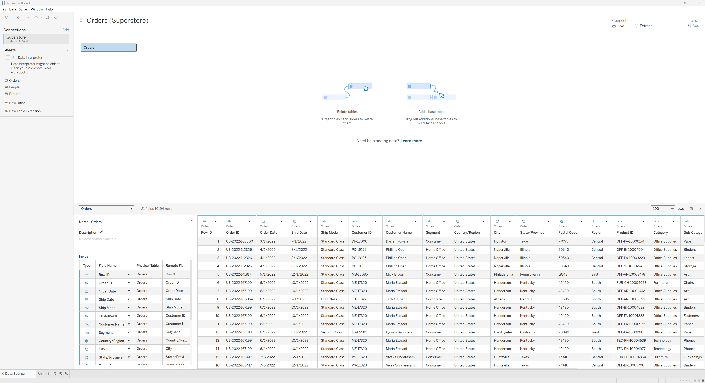
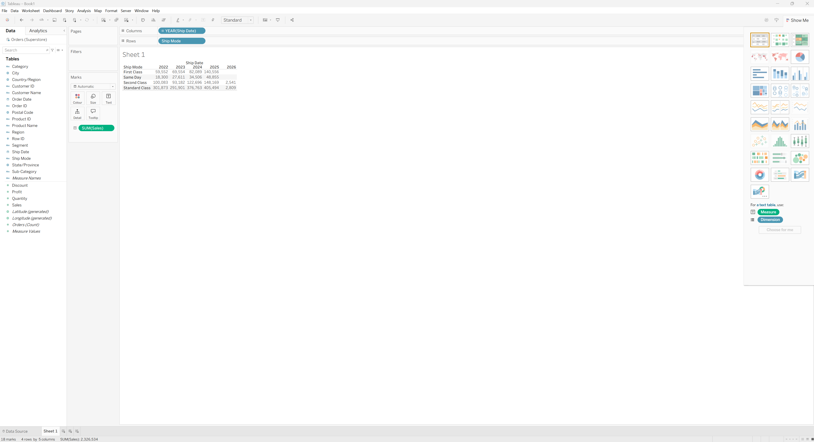

## [Tableau Desktop]{style="color:  #4682B4; font-size: 38px;"}

Tableau Desktop connects to Excel files directly through its **Connect** pane. *Superstore* excel file was imported.

A **sheet** in Tableau is a single visualisation workspace. Sheets from *Superstore* were explored.

