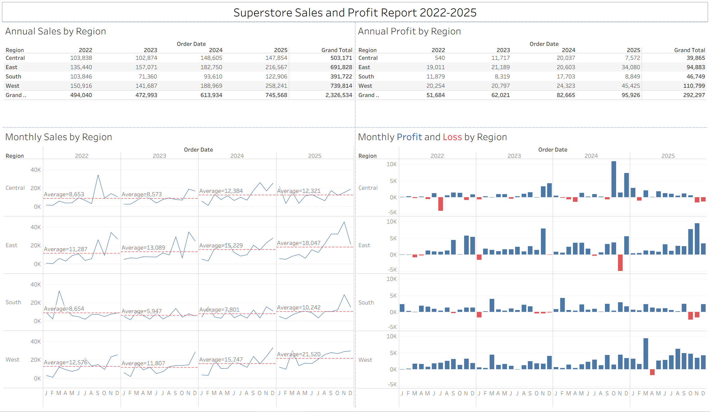

## [Tableau Public]{style="color:  #4682B4; font-size: 38px;"}

:::: {style="display: flex; align-items: center; gap: 10px; margin-bottom: 1.5rem;"}
{width="196"}

::: {style="flex: 1;"}
Tableau Public is a free platform that allows users to explore, create, and share interactive data visualizations online. It serves as a public repository of data visualizations, enabling users to learn from millions of examples and develop their own skills. The platform is accessible to anyone, making it a valuable resource for students, aspiring data analysts, seasoned professionals, and data hobbyists. Tableau Public is not just a tool for creating visualizations; it's a community where users can connect, learn, and showcase their work.
:::
::::

During in-class exercise 2, a dashboard was created using the superstore data to show the sales and profit report for 2022-2025. This report was published to Tableau Public at [the following URL](https://public.tableau.com/app/profile/mark.yee/viz/IC_EX02/Dashboard1?publish=yes&showOnboarding=true).

