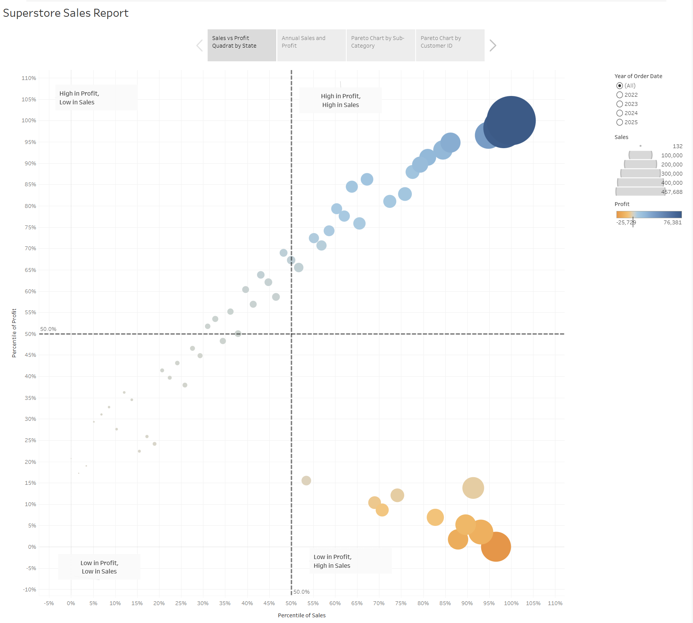
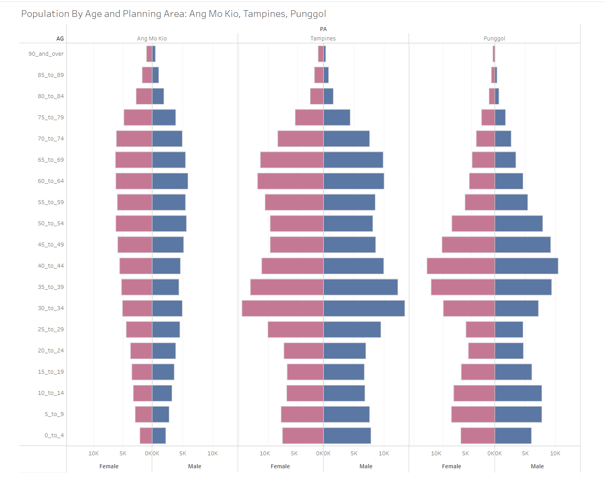

## [Programming Interactive Data Visualisation with Tableau]{style="color:  #4682B4; font-size: 38px;"}

:::: {style="display: flex; align-items: center; gap: 10px; margin-bottom: 1.5rem;"}
{width="232"}

::: {style="flex: 1;"}
**In-Class Exercise 3 — Programming Interactive Data Visualisation with Tableau**

Built an interactive Superstore Sales Report covering a sales-vs-profit quadrant scatter by state, an annual sales and profit trend, and Pareto charts by sub-category and customer ID to identify the 80/20 contributors to profit. Built an interactive Population by Age and Planning Area dashboard covering side-by-side population pyramids for Ang Mo Kio, Tampines, and Punggol, showing age-group distributions split by gender to compare demographic profiles across mature and young estates.
:::
::::

During in-class exercise 3, a story was created using the superstore data to show the sales report. A four-view interactive Tableau dashboard exploring sales and profitability across the 2022–2025 Superstore dataset and two Pareto charts (by sub-category and by customer ID) were created.

This report was published to Tableau Public at [the following URL](https://public.tableau.com/app/profile/mark.yee/viz/IC_EX03/SuperstoreSalesReport?publish=yes).

A side-by-side population pyramid dashboard comparing the demographic profiles of Ang Mo Kio, Tampines, and Punggol was also created. Each pyramid plots 5-year age bands against population counts, mirrored by gender with female in pink and male in blue. The three shapes shows us three different facts. Ang Mo Kio bulges in the 50 to 69 bands with thin youth representation. Tampines shows a bimodal profile combining established older residents with renewing young families. Punggol skews heavily toward children and parents in their 30s and 40s.

This report was published to Tableau Public at [the following URL](https://public.tableau.com/app/profile/mark.yee/viz/IC_EX03b/PopulationByAgeandPlanningArea?publish=yes).

