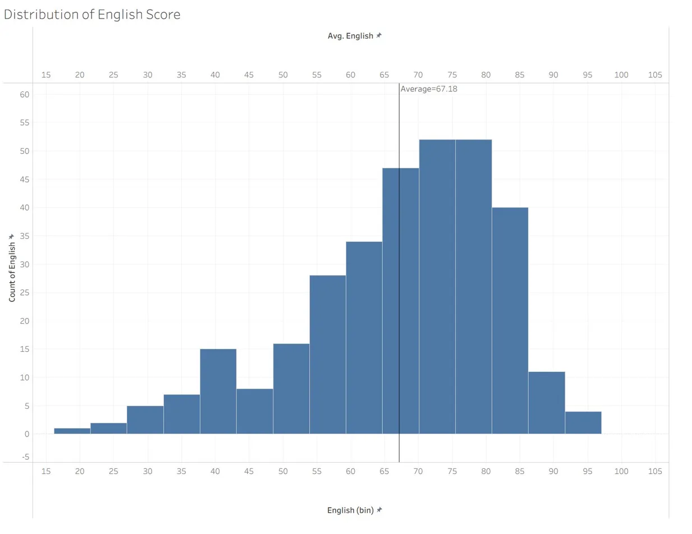
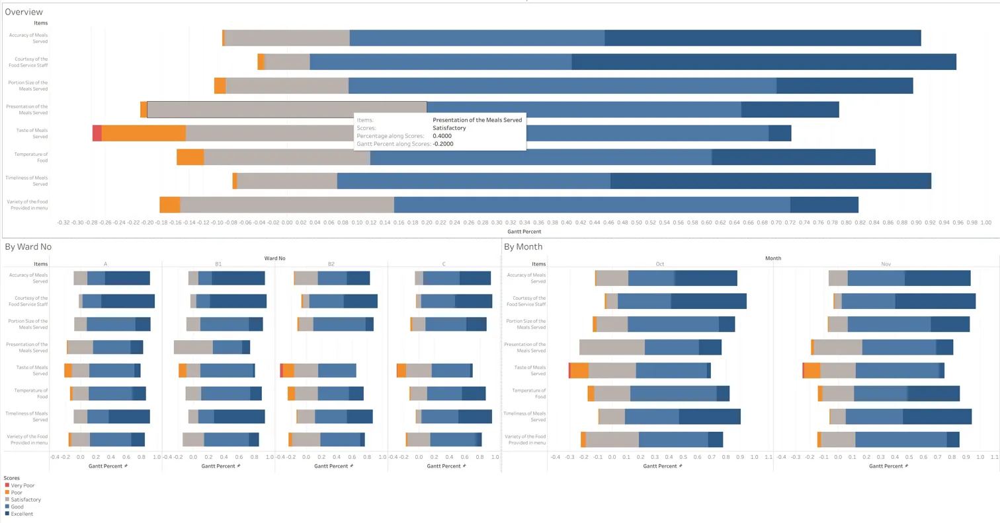

## [Programming Visual Analytics with Tableau]{style="color:  #4682B4; font-size: 38px;"}

During in-class exercise 4, three views were created to practise statistical and survey visualisation in Tableau.

The first view is a histogram of the English score distribution. The bin width is set to 5 marks. A vertical reference line marks the cohort average of 67.18. The shape is left skewed with a long lower tail, which indicates that a small group of students underperform well below the mode of 70 to 80.

This report was published to Tableau Public at [the following URL](https://public.tableau.com/app/profile/mark.yee/viz/IC_EX04-Showmethestatistics/DistributionofEnglishScore).

The second view is a boxplot of English scores by class, with individual student scores overlaid as jittered points to expose within class spread and outliers. Classes are sorted by median from 3A on the left to 3I on the right, which reveals a near monotonic decline in central tendency across the streamed classes. Class 3A has the highest median and the widest upper range, whereas class 3I has the lowest median and the narrowest spread at the bottom of the scale.

The third view is a diverging stacked bar chart of meal satisfaction scores across eight survey items, with the negative responses, Very Poor and Poor, anchored to the left of the zero baseline and the positive responses, Good and Excellent, extending to the right. Satisfactory is split across the centre. The overview panel shows that Taste of Meals Served carries the largest share of negative responses, while Courtesy of the Food Service Staff and Timeliness of Meals Served are the strongest performers. The two small multiple panels disaggregate the same structure by Ward and by Month, which allows ward level and temporal comparison without losing the overview.

This report was published to Tableau Public at [the following URL](https://public.tableau.com/app/profile/mark.yee/viz/IC_EX04a/FoodServiceKPIReport?publish=yes).
