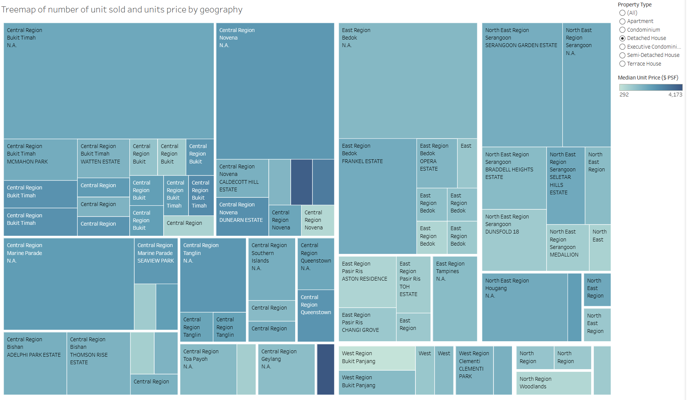

## [Visual Multivariate Analysis with Tableau]{style="color:  #4682B4; font-size: 38px;"}

During in-class exercise 5, two treemap views were created to practise multivariate visual analysis in Tableau. The exercise explores how a treemap encodes measures simultaneously within a single spatial layout. The tile area carries one measure and tile colour carries a second, allowing both to be read at a glance without mentally joining two separate panels.

The dataset for the first view is Singapore private residential property transaction records sourced from URA, covering all of 2025. The combined dataset spans approximately 29,000 transactions across private apartments, condominiums, executive condominiums, and landed properties in all five planning regions of Singapore. The second view uses the Superstore sample dataset previously used.

### Part 1 — Transaction Volume and Unit Price by Planning Area

The first view is a treemap where tile area represents the total number of transactions in each planning area and tile colour encodes the median unit price per square foot, using a sequential colour palette that runs from lighter shades for lower price levels to deeper shades for higher price levels. The two measures together reveal where the market is most active and whether that activity is concentrated in high-value or lower-value segments.

This report was published to Tableau Public at [the following URL](https://public.tableau.com/app/profile/mark.yee/viz/IC_EX05/Treemapofnumberofunitsoldandunitspricebygeography).

### Part 2 — Profit and Sales by Geography

The second view is a treemap using the Superstore sample dataset, where tile area represents total sales revenue and tile colour encodes total profit, broken down by country and region. A diverging palette is used for profit, running from orange for loss-making markets to blue for profitable ones.

This report was published to Tableau Public at [the following URL](https://public.tableau.com/app/profile/mark.yee/viz/IC_EX05a/Treemapofprfitandsalesofunitsbygeography).
