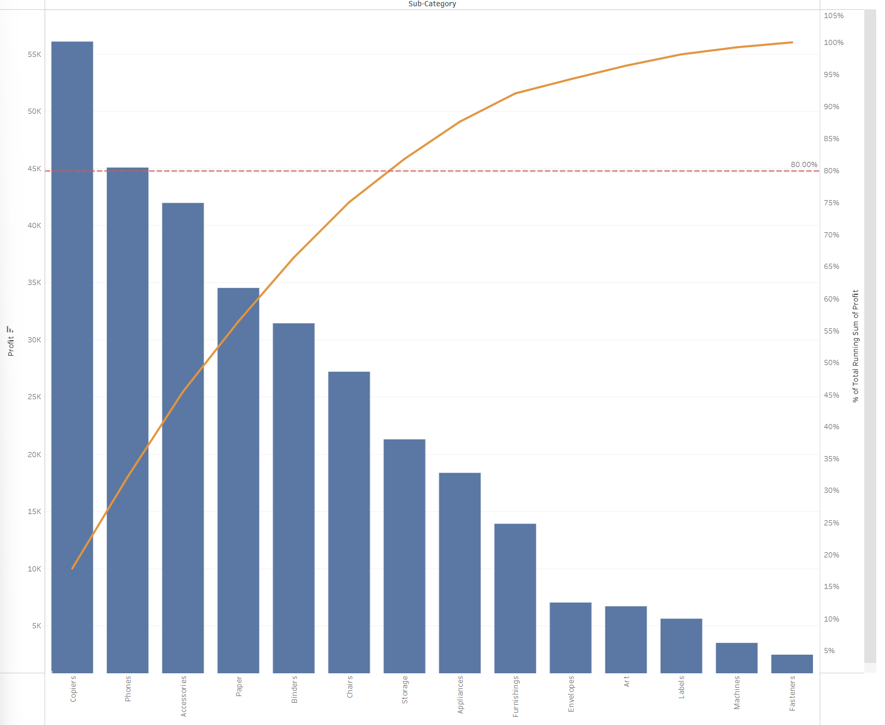
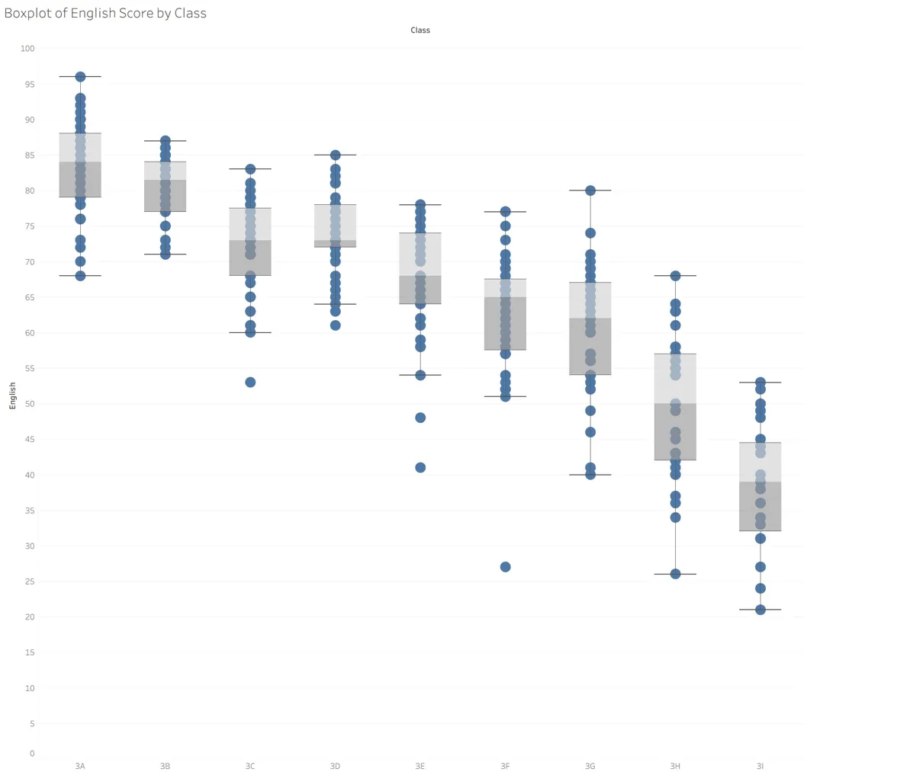

## [In-Class Exercises Index]{style="color:  #4682B4; font-size: 38px;"}

:::: {style="display: flex; align-items: center; gap: 10px; border-left: 4px solid #2C5282; padding: 10px; background-color: #f8f9fa; border-radius: 10px;"}
{width="230"}

::: {style="flex: 1;"}
**In-Class Exercise 1 — Tableau Desktop**

Explored and setup Tableau Desktop.

[Read more →](IC_EX01.html)
:::
::::

:::: {style="display: flex; align-items: center; gap: 10px; border-left: 4px solid #2C5282; padding: 10px; background-color: #f8f9fa; border-radius: 10px;"}
{width="230"}

::: {style="flex: 1;"}
**In-Class Exercise 2 — Tableau Public**

Published first dashboard to Tableau Public.

[Read more →](IC_EX02.html)
:::
::::

:::: {style="display: flex; align-items: center; gap: 10px; border-left: 4px solid #2C5282; padding: 10px; background-color: #f8f9fa; border-radius: 10px;"}
{width="232"}

::: {style="flex: 1;"}
**In-Class Exercise 3 — Programming Interactive Data Visualisation with Tableau**

Built an interactive Superstore Sales Report covering a sales-vs-profit quadrant scatter by state, an annual sales and profit trend, and Pareto charts by sub-category and customer ID to identify the 80/20 contributors to profit. Built an interactive Population by Age and Planning Area dashboard covering side-by-side population pyramids for Ang Mo Kio, Tampines, and Punggol, showing age-group distributions split by gender to compare demographic profiles across mature and young estates.

[Read more →](IC_EX03.html)
:::
::::

:::: {style="display: flex; align-items: center; gap: 10px; border-left: 4px solid #2C5282; padding: 10px; background-color: #f8f9fa; border-radius: 10px;"}
{width="232"}

::: {style="flex: 1;"}
**In-Class Exercise 4, Programming Visual Analytics with Tableau**

Built three Tableau views, namely a histogram of English scores, a boxplot of English scores by class, and a diverging stacked bar chart of hospital meal satisfaction.

[Read more →](IC_EX04.html)
:::
::::

:::: {style="display: flex; align-items: center; gap: 10px; border-left: 4px solid #2C5282; padding: 10px; background-color: #f8f9fa; border-radius: 10px;"}
{width="232"}

::: {style="flex: 1;"}
**In-Class Exercise 5 — Visual Multivariate Analysis with Tableau**

Built two treemap views to practise multivariate visual analysis. The first treemap uses Singapore private residential property transaction data across 2025, encoding transaction volume as tile area and median unit price per square foot as tile colour to expose the joint distribution of market activity and price intensity across planning areas. The second treemap uses the Superstore sample dataset, encoding total sales as tile area and total profit as tile colour to reveal where revenue volume and margin diverge across geographic markets.

[Read more →](IC_EX05.html)
:::
::::
