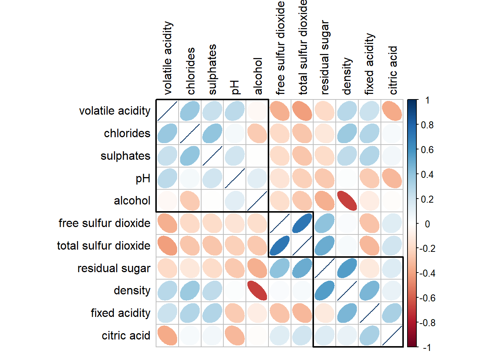
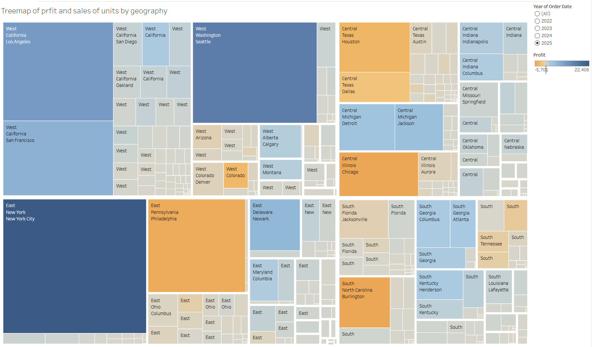
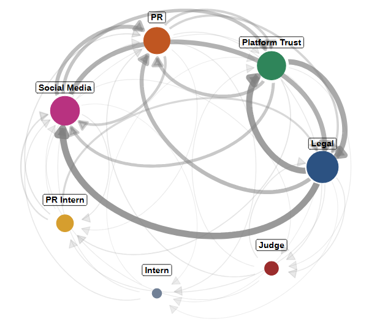

## [Welcome]{style="color: #4682B4; font-size: 38px;"}

:::: {style="display: flex; align-items: center; gap: 10px; margin-bottom: 1.5rem;"}
{width="162"}

::: {style="flex: 1;"}
Hi, I am **Mark Yee** and welcome to my course portfolio for **ISSS608 Visual Analytics and Applications**.

This site consists of my journey through the course, updated regularly as I progress through the semester. Head to the [About](about.html) page to learn more about the course.
:::
::::

## [Latest Updates]{style="color: #2C5282; font-size: 28px;"}

### [📘 Hands-on Exercises]{style="color: #366092; font-size: 20px;"}

:::: {style="display: flex; align-items: center; gap: 10px; border-left: 4px solid #2C5282; padding: 10px; background-color: #f8f9fa; border-radius: 10px;"}
{width="232"}

::: {style="flex: 1;"}
**Hands-on Exercise 5 — Correlation Analysis, Heatmaps, Ternary Plots, Parallel Coordinates Plots, and Treemaps**

Explored (1) visual correlation analysis covering scatterplot matrices, corrgrams, glyph types, and hierarchical reordering, (2) heatmaps covering data transformation, clustering, seriation, and interactive versions, (3) ternary plots covering three-part compositional data with ggtern and plotly, (4) parallel coordinates plots covering grouping, scaling, faceting, and interactive D3 versions, and (5) treemaps covering hierarchical part-of-whole data, palette and layout choices, and drill-down interactivity.

[Read more →](HO_EX05.html)
:::
::::

### [🖥️ In-class Exercises]{style="color: #366092; font-size: 20px;"}

:::: {style="display: flex; align-items: center; gap: 10px; border-left: 4px solid #2C5282; padding: 10px; background-color: #f8f9fa; border-radius: 10px;"}
{width="232"}

::: {style="flex: 1;"}
**In-Class Exercise 5 — Visual Multivariate Analysis with Tableau**

Built two treemap views to practise multivariate visual analysis. The first treemap uses Singapore private residential property transaction data across 2025, encoding transaction volume as tile area and median unit price per square foot as tile colour to expose the joint distribution of market activity and price intensity across planning areas. The second treemap uses the Superstore sample dataset, encoding total sales as tile area and total profit as tile colour to reveal where revenue volume and margin diverge across geographic markets.

[Read more →](IC_EX05.html)
:::
::::

### [📝 Take-Home Assignments]{style="color: #366092; font-size: 20px;"}

:::: {style="display: flex; align-items: center; gap: 10px; border-left: 4px solid #2C5282; padding: 10px; background-color: #f8f9fa; border-radius: 10px;"}
{width="232"}

::: {style="flex: 1;"}
**Take-home Assignment 2 — Tracing an embargo leak across an autonomous multi-agent communications system**

The analysis covers 912 messages across 23 rounds among seven AI agents communicating over six channels, reconstructing how the merger embargo was broken one hour early.

[Read more →](TH_EX02.html)
:::
::::

## [All Work]{style="color: #2C5282; font-size: 28px;"}

::::::::: grid
::: g-col-4
### [Hands-on Exercises]{style="color: #2C5282;"}
:::

::: g-col-4
### [In-class Exercises]{style="color: #2C5282;"}
:::

::: g-col-4
### [Take-home Assignments]{style="color: #2C5282;"}
:::

::: {.g-col-4 style="margin-top: -1.5rem;"}
Weekly practical exercises applying visual analytics techniques in R.

[View all →](HO_EX_index.html)
:::

::: {.g-col-4 style="margin-top: -1.5rem;"}
Short exercises completed during lessons to reinforce key concepts.

[View all →](IC_EX_index.html)
:::

::: {.g-col-4 style="margin-top: -1.5rem;"}
Independent projects applying visual analytics to real-world datasets.

[View all →](TH_EX_index.html)
:::
:::::::::
