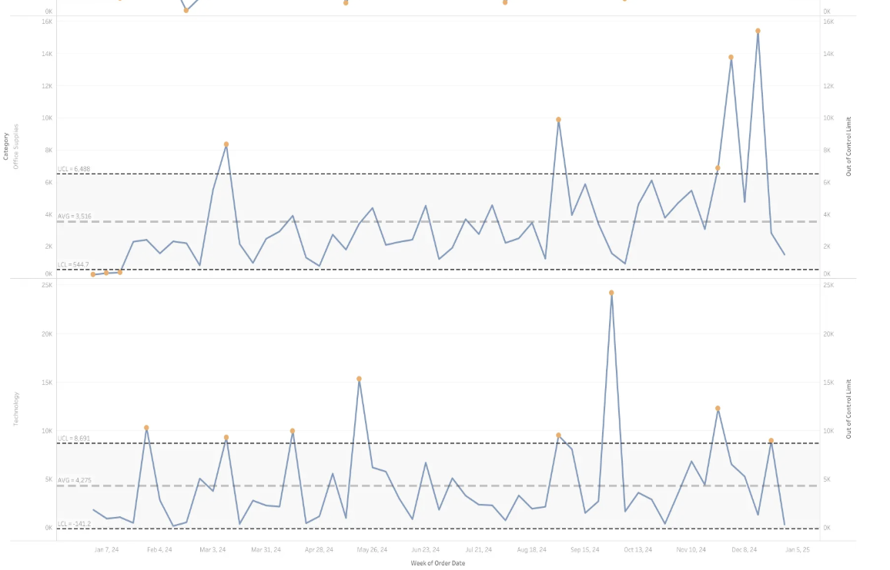
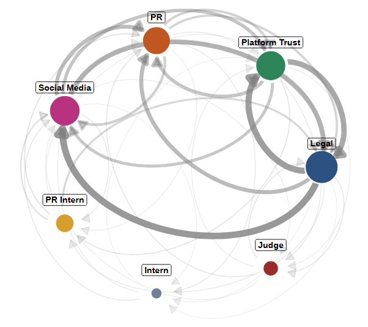

## [Welcome]{style="color: #4682B4; font-size: 38px;"}

:::: {style="display: flex; align-items: center; gap: 10px; margin-bottom: 1.5rem;"}
{width="162"}

::: {style="flex: 1;"}
Hi, I am **Mark Yee** and welcome to my course portfolio for **ISSS608 Visual Analytics and Applications**.

This site consists of my journey through the course, updated regularly as I progress through the semester. Head to the [About](about.html) page to learn more about the course.
:::
::::

## [Latest Updates]{style="color: #2C5282; font-size: 28px;"}

### [📘 Hands-on Exercises]{style="color: #366092; font-size: 20px;"}

:::: {style="display: flex; align-items: center; gap: 10px; border-left: 4px solid #2C5282; padding: 10px; background-color: #f8f9fa; border-radius: 10px;"}
{width="232"}

::: {style="flex: 1;"}
**Hands-on Exercise 9 — Geospatial Choropleth, Point and Analytical Mapping**

Explored three geospatial mapping workflows with sf and tmap, (1) choropleth mapping covering shapefile and aspatial data import, georelational joins, qtm and tmap element layers, data classification methods, colour schemes, map layouts and small multiple facet maps, (2) geospatial point data covering aspatial-to-sf conversion with projection assignment and interactive proportional symbol maps in tmap view mode, and (3) analytical mapping covering rate maps, percentile maps and box maps built with custom break functions over Nigeria water-point data.

[Read more →](HO_EX09a.html)
:::
::::

### [🖥️ In-class Exercises]{style="color: #366092; font-size: 20px;"}

:::: {style="display: flex; align-items: center; gap: 10px; border-left: 4px solid #2C5282; padding: 10px; background-color: #f8f9fa; border-radius: 10px;"}
{width="232"}

::: {style="flex: 1;"}
**In-Class Exercise 8 — Visual Analysis of Time-oriented Data with Tableau**

Built three time-oriented Tableau views and published each to Tableau Public, namely a control chart of sales by category, a slopegraph and a trend-and-cycle view of arrivals. Each view is embedded live on the exercise page.

[Read more →](IC_EX08.html)
:::
::::

### [📝 Take-Home Assignments]{style="color: #366092; font-size: 20px;"}

:::: {style="display: flex; align-items: center; gap: 10px; border-left: 4px solid #2C5282; padding: 10px; background-color: #f8f9fa; border-radius: 10px;"}
{width="232"}

::: {style="flex: 1;"}
**Take-home Assignment 2 — Tracing an embargo leak across an autonomous multi-agent communications system**

The analysis covers 912 messages across 23 rounds among seven AI agents communicating over six channels, reconstructing how the merger embargo was broken one hour early.

[Read more →](TH_EX02.html)
:::
::::

## [All Work]{style="color: #2C5282; font-size: 28px;"}

::::::::: grid
::: g-col-4
### [Hands-on Exercises]{style="color: #2C5282;"}
:::

::: g-col-4
### [In-class Exercises]{style="color: #2C5282;"}
:::

::: g-col-4
### [Take-home Assignments]{style="color: #2C5282;"}
:::

::: {.g-col-4 style="margin-top: -1.5rem;"}
Weekly practical exercises applying visual analytics techniques in R.

[View all →](HO_EX_index.html)
:::

::: {.g-col-4 style="margin-top: -1.5rem;"}
Short exercises completed during lessons to reinforce key concepts.

[View all →](IC_EX_index.html)
:::

::: {.g-col-4 style="margin-top: -1.5rem;"}
Independent projects applying visual analytics to real-world datasets.

[View all →](TH_EX_index.html)
:::
:::::::::
